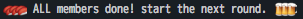

talker
======

## Description

This script is choose a talker.

Please use to study sessions presenter extraction, etc.

It uses the dropbox in storage, it does not overlap anyone is running.

## Usage

```
$ talker select

> taketin
```

if all members selected



Other usage please look at the help in `talker -h`

## Install

```
$ go get github.com/taketin/talker
$ mkdir -p $GOPATH/config/talker
$ vi config.tml # edit your settings
$ mv config.tml $GOPATH/config/talker/
```

## Contribution

1. Fork it
1. Create your feature branch (git checkout -b my-new-feature)
1. Commit your changes (git commit -am 'Add some feature')
1. Push to the branch (git push origin my-new-feature)
1. Create new Pull Request

## Author

@taketin
